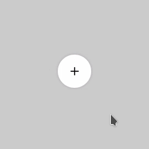
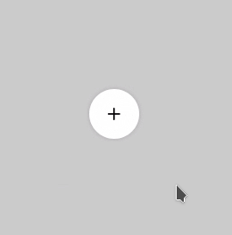
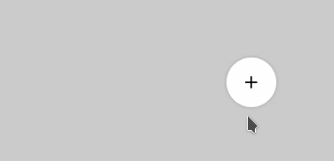
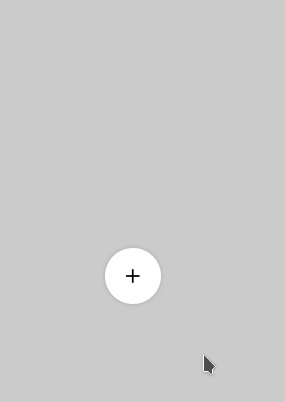
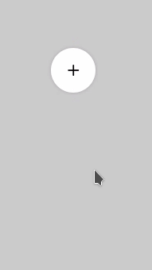

# Что такое SimpleFAB
SimpleFAB это небольшой проект для реализации [Floating Action Bar ](https://material.io/components/buttons-floating-action-button) с помощью HTML/CSS/Vanilla JS. Данный элемент не требует сложной логики, поэтому проект ограничивается двумя файлами.

## Пример реализации
SimpleFAB может иметь разные варианты представления, которые контролируются через атрибут **data-fab-type**:

### Spin mode
> ``` <div class="sfab" id="test" data-fab-type="spin"> ``` <br>
>

### Open mode
> ``` <div class="sfab" id="test" data-fab-type="open"> ``` <br>
>

### Left mode
> ``` <div class="sfab" id="test" data-fab-type="left"> ``` <br>
>

### Right mode
> ``` <div class="sfab" id="test" data-fab-type="right"> ``` <br>
>

### Top mode
> ``` <div class="sfab" id="test" data-fab-type="top"> ``` <br>
>

### Bottom mode
> ``` <div class="sfab" id="test" data-fab-type="bottom"> ``` <br>
>